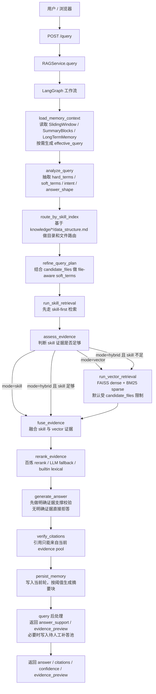
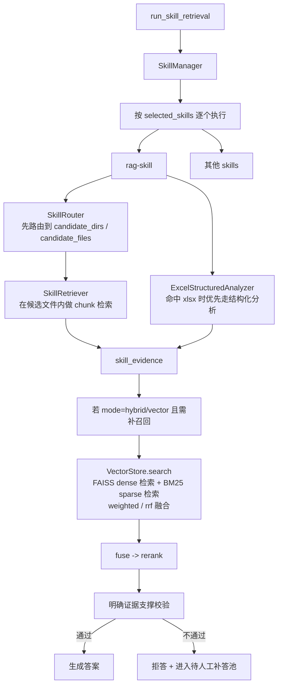
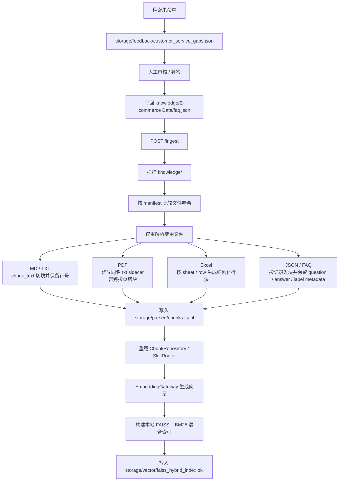

# Skill-First Hybrid RAG

[](https://www.python.org/)
[](https://fastapi.tiangolo.com/)
[](https://github.com/langchain-ai/langgraph)
[](https://github.com/facebookresearch/faiss)

一个可运行的 `Skill-first + FAISS + BM25 + LangGraph` RAG 系统，支持多模型厂商、分层记忆、Web 聊天界面，以及本地 `FAISS 稠密召回 + BM25 稀疏召回` 混合检索。

## 目录

1. [项目简介](#项目简介)
2. [已实现功能](#已实现功能)
3. [技术栈](#技术栈)
4. [架构与流程](#架构与流程)
5. [FAISS 混合检索设计](#faiss-混合检索设计)
6. [项目结构](#项目结构)
7. [环境要求](#环境要求)
8. [环境变量配置](#环境变量配置)
9. [快速开始](#快速开始)
10. [API 概览](#api-概览)
11. [运行与调试建议](#运行与调试建议)
12. [当前边界](#当前边界)
13. [致谢](#致谢)
14. [许可证](#许可证)

## 项目简介

本项目是一个本地知识库 RAG 系统，核心思路是：

1. 先用 `Skill` 做目录和文件级路由
2. 再执行 skill 检索
3. 若证据不足，再通过 `FAISS + BM25` 做本地混合补召回
4. 通过 `LangGraph` 编排全过程
5. 结合分层记忆实现跨轮连续对话

它不是单纯的“文档切块 + 向量库问答”演示，而是把以下约束真正放进了执行链路：

1. `Skill-first`
2. `PDF/Excel references` 强制读取
3. `无证据拒答`
4. `引用校验`
5. `多轮会话记忆`

## 已实现功能

1. `Skill-first` 检索主路径
2. `FAISS + BM25` 本地混合补召回
3. `LangGraph` 编排问答流程
4. 自动注册并调用 `.agent/skills/*/SKILL.md`
5. `PDF/Excel` 强制先读 skill references
6. `Excel` 结构化分析（LLM 规划 + pandas 执行）
7. `JSON FAQ` 记录级索引与字段级加权检索
8. 多模型厂商支持（chat / embedding / rerank）
9. 分层记忆（SlidingWindow + SummaryBlocks + LongTermMemory）
10. Web 聊天页 + REST API
11. 电商客服问答闭环：未命中问题自动入待处理池，人工补答后回写 FAQ 并重建索引

## 技术栈

后端与编排：

1. `Python 3.11+`
2. `FastAPI`
3. `LangGraph`
4. `Pydantic / pydantic-settings`

检索与数据处理：

1. `FAISS`
2. `BM25`
3. `pandas`
4. `openpyxl`
5. `pypdf`
6. `numpy`

模型调用：

1. `openai` SDK（兼容多厂商 OpenAI-compatible API）
2. `requests`

当前默认模型组合：

1. `chat`: `zhipu / glm-5`
2. `embedding`: `bailian / text-embedding-v4`
3. `rerank`: `bailian / qwen3-rerank`

## 架构与流程

主流程（简化）：

```text
/query
  -> load_memory_context
  -> analyze_query
  -> route_by_skill_index
  -> refine_query_plan
  -> run_skill_retrieval
  -> assess_evidence
  -> run_vector_retrieval (FAISS + BM25 if needed)
  -> fuse
  -> rerank
  -> generate
  -> verify_citations
  -> persist_memory
```

详细工作流图：







关键原则：

1. `Skill` 先行，向量层只做补召回
2. 混合检索默认受 `candidate_files` 限制
3. 无证据时拒答，不做无依据生成
4. 引用必须来自本轮 evidence pool
5. 追问改写由模型判断是否需要结合上下文

## FAISS 混合检索设计

当前默认向量层不是单纯 embedding 矩阵点积，而是 `FAISS dense retrieval + local BM25 sparse retrieval`。

设计如下：

1. 稠密召回
   - 由 embedding provider 生成向量
   - 当前默认使用百炼 `text-embedding-v4`
   - 使用 `FAISS IndexFlatIP` 做稠密检索
2. 稀疏召回
   - 使用本地 BM25 统计索引
   - 基于 chunk 文本和文件名联合建模
3. 查询方式
   - `mode=vector` 直接走混合检索
   - `mode=hybrid` 在 skill 证据不足时触发混合检索
4. 混合排序
   - 默认 `weighted`
   - 支持 `rrf`
5. 检索后处理
   - 结果仍会进入 `fuse -> rerank -> generate` 流程

当前相关实现见：

1. `src/rag_graph/vector_store/index.py`
2. `src/rag_graph/service.py`

## 项目结构

```text
rag-skill-main/
├─ .agent/
│  └─ skills/
│     ├─ rag-skill/
│     │  ├─ SKILL.md
│     │  └─ references/
│     │     ├─ pdf_reading.md
│     │     ├─ excel_reading.md
│     │     └─ excel_analysis.md
│     └─ skill-creator/
├─ knowledge/
├─ src/
│  └─ rag_graph/
│     ├─ api/
│     ├─ feedback/
│     ├─ graph/
│     ├─ memory/
│     ├─ models/
│     ├─ parser_cache/
│     ├─ query_runtime/
│     ├─ skill_runtime/
│     └─ vector_store/
├─ storage/
├─ .env.example
├─ requirements.txt
├─ pyproject.toml
└─ README.md
```

## 环境要求

1. `Python >= 3.11`
2. 安装 `faiss-cpu`
3. Windows / Linux / macOS（示例命令使用 PowerShell）
4. 注册百炼，智谱api并配置到系统变量（这两家都会赠送新人token）

## 环境变量配置

项目使用 `RAG_` 前缀环境变量，并兼容部分厂商默认变量。

常用变量如下：

| 变量 | 说明 | 默认值 |
| --- | --- | --- |
| `RAG_CHAT_PROVIDER` | chat 提供方 | `zhipu` |
| `RAG_CHAT_MODEL` | chat 模型 | `glm-5` |
| `RAG_EMBED_PROVIDER` | embedding 提供方 | `bailian` |
| `RAG_EMBED_MODEL` | embedding 模型 | `text-embedding-v4` |
| `RAG_RERANK_PROVIDER` | rerank 提供方 | `bailian` |
| `RAG_RERANK_MODEL` | rerank 模型 | `qwen3-rerank` |
| `RAG_VECTOR_BACKEND` | 向量后端 | `faiss` |
| `RAG_FAISS_HYBRID_RANKER` | 混合排序器 | `weighted` |
| `RAG_FAISS_DENSE_WEIGHT` | dense 权重 | `0.65` |
| `RAG_FAISS_SPARSE_WEIGHT` | BM25 权重 | `0.35` |
| `RAG_BM25_K1` | BM25 k1 参数 | `1.5` |
| `RAG_BM25_B` | BM25 b 参数 | `0.75` |
| `ZHIPU_API_KEY` | 智谱 API Key | 无 |
| `DASHSCOPE_API_KEY` | 百炼 API Key | 无 |

当前仅支持 `faiss`，即使环境里残留旧值，也应改为 `faiss`。示例配置见 [`.env.example`](.env.example)。

## 快速开始

1. 安装依赖

```powershell
python -m pip install --user -r requirements.txt
```

2. 配置模型与后端

```powershell
$env:RAG_CHAT_PROVIDER = "zhipu"
$env:RAG_CHAT_MODEL = "glm-5"
$env:RAG_EMBED_PROVIDER = "bailian"
$env:RAG_EMBED_MODEL = "text-embedding-v4"
$env:RAG_RERANK_PROVIDER = "bailian"
$env:RAG_RERANK_MODEL = "qwen3-rerank"
$env:RAG_VECTOR_BACKEND = "faiss"

$env:ZHIPU_API_KEY = "your_zhipu_key"
$env:DASHSCOPE_API_KEY = "your_dashscope_key"
```

3. 启动服务

```powershell
$env:PYTHONPATH = "src"
python -m uvicorn rag_graph.api.main:app --host 0.0.0.0 --port 8000
```

4. 首次构建索引

```powershell
Invoke-RestMethod -Method Post `
  -Uri "http://127.0.0.1:8000/ingest" `
  -ContentType "application/json" `
  -Body '{"force": false}'
```

这一步会：

1. 解析 `knowledge/` 中的文件
2. 写入 `storage/parsed/chunks.jsonl`
3. 构建 `FAISS + BM25` 本地混合索引
4. 同步写入 `storage/vector/faiss_hybrid_index.pkl`

5. 打开页面

1. 聊天页：`http://127.0.0.1:8000/`
2. OpenAPI：`http://127.0.0.1:8000/docs`

6. 发起查询（API 示例）

```powershell
$body = @{
  query = "三一重工的前三大股东是谁？"
  mode  = "hybrid"   # skill | hybrid | vector
  top_k = 8
  session_id = "demo-session-1"
  actor_id   = "demo-user-1"
} | ConvertTo-Json

Invoke-RestMethod -Method Post `
  -Uri "http://127.0.0.1:8000/query" `
  -ContentType "application/json" `
  -Body $body
```

7. 健康检查

```powershell
Invoke-RestMethod "http://127.0.0.1:8000/health"
```

你会在返回结果中看到：

1. `vector_backend`
2. `vector_index_ready`
3. `vector_index_metadata`
4. `vector_dimension`
5. `customer_service_feedback`
6. `answer_support`
7. `evidence_preview`

## 电商客服问答闭环

当同时满足下面两个条件时，系统会自动把问题记入待处理池：

1. 当前问题已经完成一次完整检索
2. 本轮最终没有检索到任何明确可用的知识证据

默认存储位置：

1. 待处理池：`storage/feedback/customer_service_gaps.json`
2. FAQ 问答库：`knowledge/E-commerce Data/faq.json`

闭环流程：

1. 用户提出电商客服问题
2. 系统完成检索，但没有拿到任何明确可回答证据
3. `/query` 返回 `customer_service_feedback.captured=true`
4. 运营或人工客服查看待处理问题
5. 人工填写标准答案
6. 系统把新问答对写回 `faq.json`
7. 自动触发一次 `/ingest`
8. 后续同类问题可直接命中 FAQ

另外，`/query` 还会返回：

1. `answer_support`
   - 标识当前答案是否有明确证据支撑
   - 包含 `max_support_score` 和门槛值
2. `evidence_preview`
   - 返回本轮实际命中的原始证据预览
   - 包含来源文件、位置、检索来源、分数和片段摘要

查看待处理问题：

```powershell
Invoke-RestMethod `
  "http://127.0.0.1:8000/customer-service/gaps?status=open&limit=50"
```

人工补答并回写 FAQ：

```powershell
$body = @{
  answer = "进入订单详情页后提交退款申请即可。"
  reviewer = "ops"
  label = "refund"
  auto_ingest = $true
} | ConvertTo-Json

Invoke-RestMethod -Method Post `
  -Uri "http://127.0.0.1:8000/customer-service/gaps/<gap_id>/resolve" `
  -ContentType "application/json; charset=utf-8" `
  -Body $body
```

## API 概览

1. `GET /`
2. `GET /chat`
3. `GET /health`
4. `POST /ingest`
5. `POST /query`
6. `POST /evaluate`
7. `GET /skills`
8. `POST /skills/execute`
9. `GET /customer-service/gaps`
10. `POST /customer-service/gaps/{gap_id}/resolve`


## 致谢

项目中 `skill` 设计与思路参考了 [ConardLi/rag-skill](https://github.com/ConardLi/rag-skill)。

## 许可证

本项目用于学习与工程实践演示。示例数据请按各自来源和使用条款处理。
