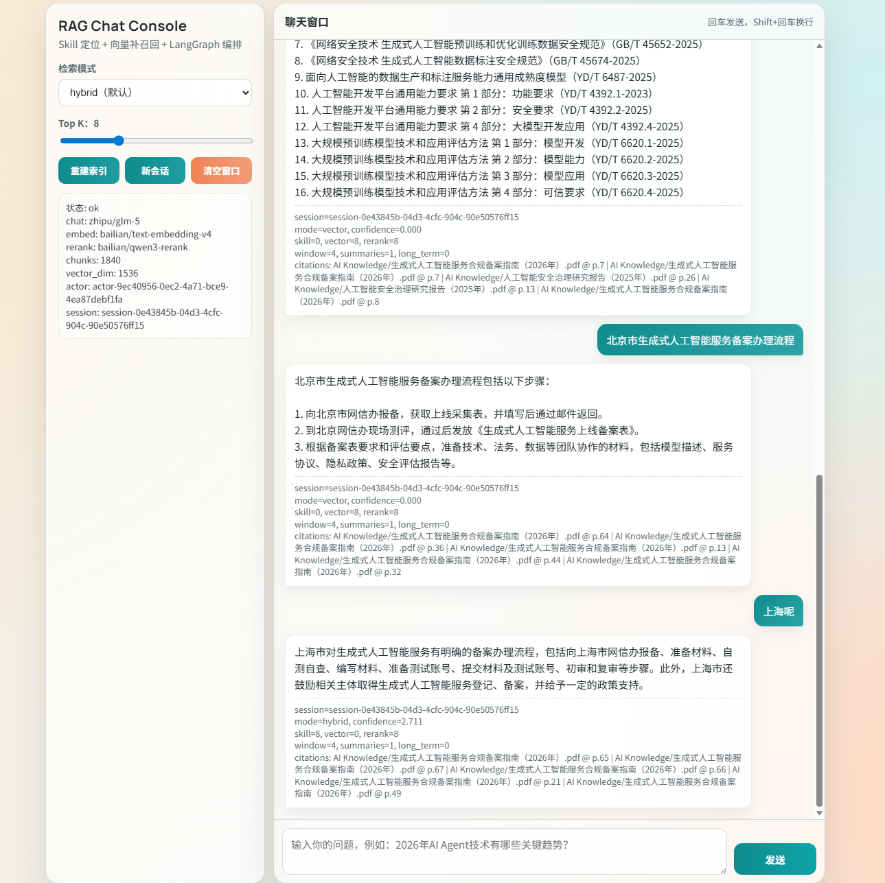
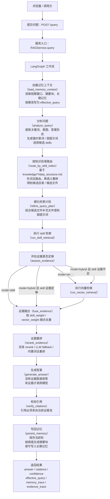
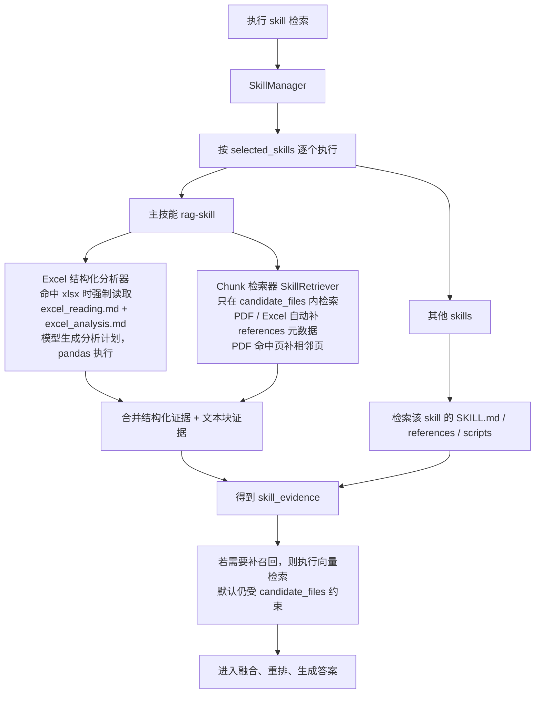
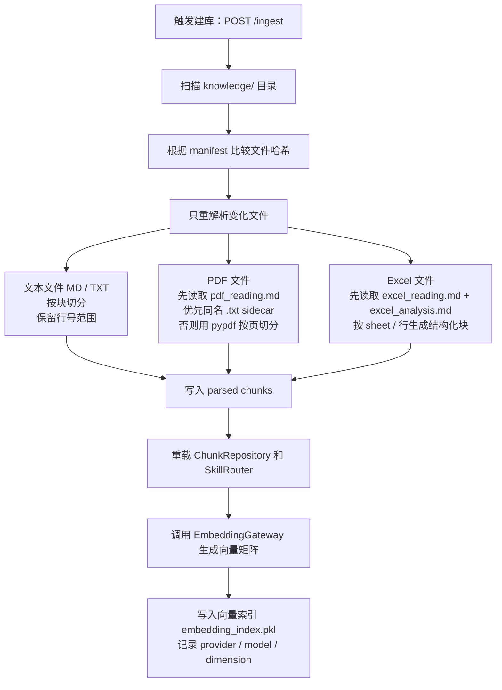

# Skill-First Hybrid RAG

[](https://www.python.org/)
[](https://fastapi.tiangolo.com/)
[](https://github.com/langchain-ai/langgraph)

一个可运行的 `Skill-first + Vector-augmented + LangGraph` RAG 系统，支持多模型厂商、分层记忆和 Web 聊天界面。

## 目录

1. [项目简介](#项目简介)
2. [已实现功能](#已实现功能)
3. [技术栈](#技术栈)
4. [架构与流程](#架构与流程)
5. [优化点](#优化点)
6. [项目结构](#项目结构)
7. [环境要求](#环境要求)
8. [环境变量配置](#环境变量配置)
9. [快速开始](#快速开始)
10. [API 概览](#api-概览)
11. [运行与调试建议](#运行与调试建议)
12. [当前边界](#当前边界)
13. [致谢](#致谢)
14. [许可证](#许可证)

## 项目简介


本项目是一个本地知识库 RAG 系统，核心思路是：

1. 先用 `Skill` 做目录和文件级路由
2. 再做 skill 检索
3. 证据不足时再做向量补召回
4. 通过 `LangGraph` 编排全过程
5. 结合分层记忆实现跨轮连续对话

## 已实现功能

1. `Skill-first` 检索主路径
2. `Vector-augmented` 补召回
3. `LangGraph` 编排问答流程
4. 自动注册并调用 `.agent/skills/*/SKILL.md`
5. `PDF/Excel` 强制先读 skill references
6. `Excel` 结构化分析（LLM 规划 + pandas 执行）
7. 多模型厂商支持（chat / embedding / rerank）
8. 分层记忆（SlidingWindow + SummaryBlocks + LongTermMemory）
9. Web 聊天页 + REST API
##工作流
下面这张是当前系统真实的在线问答主链路

检索子链路再展开一层

离线建库链路

## 技术栈

后端与编排：

1. `Python 3.11+`
2. `FastAPI`
3. `LangGraph`
4. `Pydantic / pydantic-settings`

检索与数据处理：

1. `pandas`
2. `openpyxl`
3. `pypdf`
4. `numpy`

模型调用：

1. `openai` SDK（兼容多厂商 OpenAI-compatible API）
2. `requests`

## 架构与流程

主流程（简化）：

```text
/query
  -> load_memory_context
  -> analyze_query
  -> route_by_skill_index
  -> refine_query_plan
  -> run_skill_retrieval
  -> assess_evidence
  -> run_vector_retrieval (if needed)
  -> fuse
  -> rerank
  -> generate
  -> verify_citations
  -> persist_memory
```

关键原则：

1. `Skill` 先行，向量只做补召回
2. 向量检索默认受 `candidate_files` 限制
3. 无证据时拒答，不做无依据生成
4. 引用必须来自本轮 evidence pool
5. 追问改写由模型判断是否需要结合上下文

## 优化点

检索优化：

1. `SkillRouter` 先词法路由再语义重排
2. `hybrid` 模式按证据质量决定是否触发向量补召回
3. 向量检索限制在候选文件集合内

文档处理优化：

1. PDF 解析优先同名 `.txt` sidecar
2. Excel 使用结构化执行，不只行文本匹配
3. 解析与索引支持增量更新（manifest/hash）

记忆优化：

1. SlidingWindow 维护短期连续性
2. SummaryBlocks 压缩中期上下文
3. LongTermMemory 保守写入，降低知识污染风险
4. 支持路径索引回溯：`memory://sessions/{session_id}/turns/{turn_id}`

可观测性优化：

1. `/health` 输出模型、索引、目录与进程状态
2. `/query` 输出 `effective_query / memory_trace / evidence_trace`

## 项目结构

```text
rag-skill-main/
├─ .agent/
│  └─ skills/
│     ├─ rag-skill/
│     │  ├─ SKILL.md
│     │  └─ references/
│     │     ├─ pdf_reading.md
│     │     ├─ excel_reading.md
│     │     └─ excel_analysis.md
│     └─ skill-creator/
├─ knowledge/
├─ src/
│  └─ rag_graph/
│     ├─ api/
│     ├─ graph/
│     ├─ memory/
│     ├─ models/
│     ├─ parser_cache/
│     ├─ query_runtime/
│     ├─ skill_runtime/
│     └─ vector_store/
├─ storage/
├─ requirements.txt
├─ pyproject.toml
└─ README.md
```

## 环境要求

1. `Python >= 3.11`
2. Windows / Linux / macOS（示例命令使用 PowerShell）

## 环境变量配置

项目使用 `RAG_` 前缀环境变量，并兼容部分厂商默认变量。

智谱和百炼新人注册都有免费赠送的token，申请apikey后配置到环境变量即可运行。

常用变量：

| 变量 | 说明 | 默认值 |
| --- | --- | --- |
| `RAG_CHAT_PROVIDER` | chat 提供方 | `zhipu` |
| `RAG_CHAT_MODEL` | chat 模型 | `glm-5` |
| `RAG_EMBED_PROVIDER` | embedding 提供方 | `bailian` |
| `RAG_EMBED_MODEL` | embedding 模型 | `text-embedding-v4` |
| `RAG_RERANK_PROVIDER` | rerank 提供方 | `bailian` |
| `RAG_RERANK_MODEL` | rerank 模型 | `qwen3-rerank` |
| `ZHIPU_API_KEY` | 智谱 API Key | 无 |
| `DASHSCOPE_API_KEY` | 百炼 API Key | 无 |

示例 `.env`：

```env
RAG_CHAT_PROVIDER=zhipu
RAG_CHAT_MODEL=glm-5

RAG_EMBED_PROVIDER=bailian
RAG_EMBED_MODEL=text-embedding-v4

RAG_RERANK_PROVIDER=bailian
RAG_RERANK_MODEL=qwen3-rerank

ZHIPU_API_KEY=your_zhipu_key
DASHSCOPE_API_KEY=your_dashscope_key
```

## 快速开始

1. 安装依赖

```powershell
python -m pip install --user -r requirements.txt
```

2. 启动服务

```powershell
$env:PYTHONPATH = "src"
python -m uvicorn rag_graph.api.main:app --host 0.0.0.0 --port 8000
```

3. 打开页面

1. 聊天页：`http://127.0.0.1:8000/` （将该网址输入浏览器即可打开）
2. OpenAPI：`http://127.0.0.1:8000/docs`

4. 首次构建索引

```powershell
Invoke-RestMethod -Method Post `
  -Uri "http://127.0.0.1:8000/ingest" `
  -ContentType "application/json" `
  -Body '{"force": false}'
```

5. 发起查询（API 示例）

```powershell
$body = @{
  query = "三一重工的前三大股东是谁？"
  mode  = "hybrid"   # skill | hybrid | vector
  top_k = 8
  session_id = "demo-session-1"
  actor_id   = "demo-user-1"
} | ConvertTo-Json

Invoke-RestMethod -Method Post `
  -Uri "http://127.0.0.1:8000/query" `
  -ContentType "application/json" `
  -Body $body
```

6. 健康检查

```powershell
Invoke-RestMethod "http://127.0.0.1:8000/health"
```

## API 概览

1. `GET /`
2. `GET /chat`
3. `GET /health`
4. `POST /ingest`
5. `POST /query`
6. `POST /evaluate`
7. `GET /skills`
8. `POST /skills/execute`

## 运行与调试建议

1. 修改 `src/rag_graph/**/*.py` 后重启服务
2. 修改 `knowledge/` 文件后重新执行 `/ingest`
3. 切换 embedding provider/model 后重新执行 `/ingest`
4. 异常定位优先看 `/health` 和 `/query` 的 `memory_trace/evidence_trace`


## 致谢

项目中 `skill` 设计与思路参考了 [ConardLi/rag-skill](https://github.com/ConardLi/rag-skill)。


## 许可证

本项目用于学习与工程实践演示。示例数据请按各自来源和使用条款处理。


